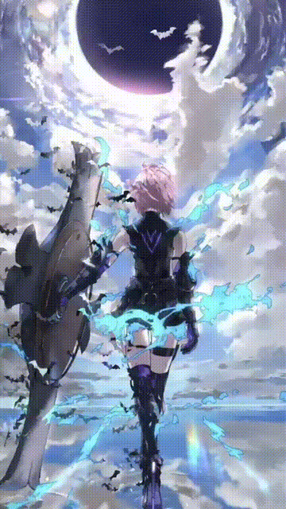

## AboutMe

- I'm a college student in Zhejiang University of Technology, majored in Digital Media Technology
- Enthusiastic about Computer Graphics, especially anything related to rendering
	- 3D Reconstruction
	- Non-Photorealistic Rendering
- Aspiring to Technical Artist and do R&D in CG

## Stats

  

More

 
<table align="center">
<tr>
<td></td>
<td></td>
</tr>
</table>
 

