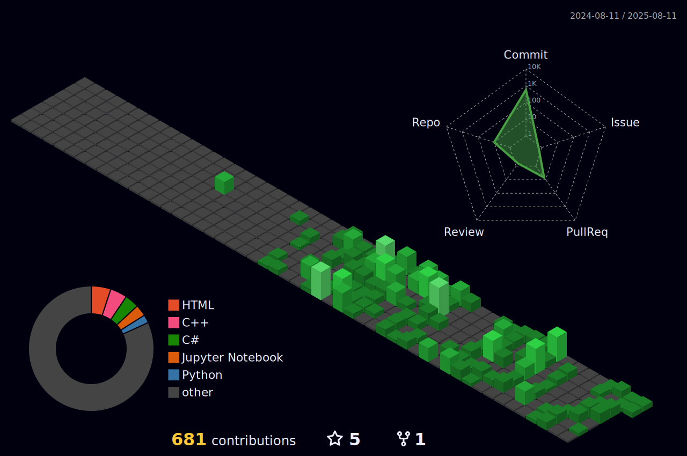

## Hi TheOnlyProblem(congyuxiaoyoudao) there 👋

- 🎒 I’m a mundane college student
- 🌱 Also enthusiastic about computer graphics
- 💖 Currently learning NPR style shading
- 🔭 Looking forward to becoming a qualified technical artist

  

 
 

